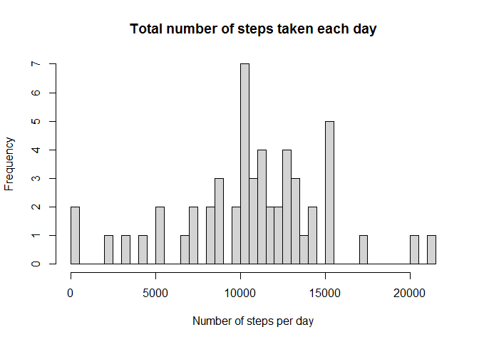
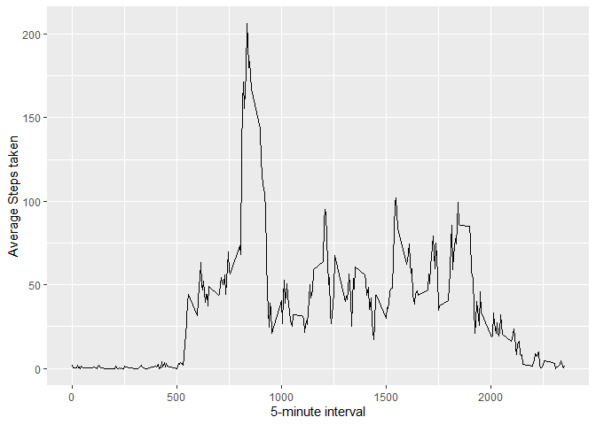
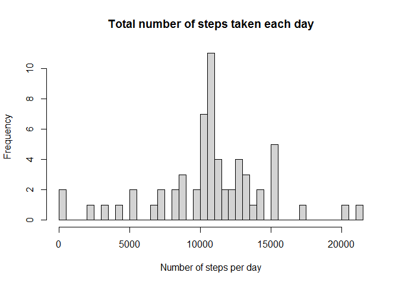
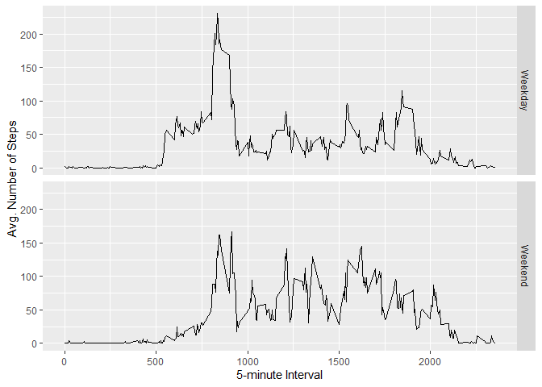

This assignment makes use of data from a personal activity monitoring device. This device collects data at 5 minute intervals through out the day. The data consists of two months of data from an anonymous individual collected during the months of October and November, 2012 and include the number of steps taken in 5 minute intervals each day.

The data for this assignment can be downloaded from the course web site: 
https://d396qusza40orc.cloudfront.net/repdata%2Fdata%2Factivity.zip

The variables included in this dataset are:

steps: Number of steps taking in a 5-minute interval (missing values are coded as NA)

date: The date on which the measurement was taken in YYYY-MM-DD format

interval: Identifier for the 5-minute interval in which measurement was taken

## Loading and preprocessing the data

```r
#Unzip data, read and load into R
unzip (zipfile = "activity.zip")
data <- read.csv ("activity.csv")
data_act <- na.omit(data) 
```

## What is mean total number of steps taken per day?

```r
#calculating sum of total number of steps/day
steps_day<- aggregate(list(Steps=data_act$steps), by = list(Date=data_act$date) ,"sum")
hist(steps_day$Steps,main = "Total number of steps taken each day", breaks = 50,
     xlab = "Number of steps per day")
```

<!-- -->

The mean and median of the total number of steps taken per day can be calculated as follows 

```r
mean(steps_day$Steps)
```

```
## [1] 10766.19
```


```r
median(steps_day$Steps)
```

```
## [1] 10765
```

## What is the average daily activity pattern?

```r
library(ggplot2)
```

```
## Warning: package 'ggplot2' was built under R version 4.1.2
```

```r
average<-aggregate(list(steps=data_act$steps),by=list(interval=data_act$interval),mean)
ggplot(data=average, aes(x=interval, y=steps)) +
    geom_line() +
    xlab("5-minute interval") +
    ylab("Average Steps taken")
```

<!-- -->

**Which 5-minute interval, on average across all the days in the dataset, contains the maximum number of steps?**

```r
average [which.max(average$steps),]
```

```
##     interval    steps
## 104      835 206.1698
```

## Inputting missing values
First step in order to replace missing values is to identify the missing values in the data set, which is done as follows:

```r
missing <- is.na(data$steps)
table(missing)
```

```
## missing
## FALSE  TRUE 
## 15264  2304
```
All the missing values are filled with mean for that 5-minute interval.

```r
#Writing a function to replace the missing values with mean value
fill_value <- function(steps, interval) {
    filled <- NA
    if (!is.na(steps))
        filled <- c(steps)
    else
        filled <- (average[average$interval==interval, "steps"])
    return(filled)
}
filled_data <- data
filled_data$steps <- mapply(fill_value, filled_data$steps, filled_data$interval)
```

The new data set with missing data filled in, is created. 

The histogram of the total number of steps taken each day and the new mean and median are also calculated. 

```r
#calculating sum of total number of steps/day for the new dataset
filled_steps_day<- aggregate(list(Steps=filled_data$steps), by = list(Date = filled_data$date),"sum")
hist(filled_steps_day$Steps,main = "Total number of steps taken each day",  breaks = 50,xlab = "Number of steps per day")
```

<!-- -->


```r
#Calculating new mean and median 
mean(filled_steps_day$Steps)
```

```
## [1] 10766.19
```


```r
median(filled_steps_day$Steps)
```

```
## [1] 10766.19
```
From the above calculations, it is clear that the mean and median values are higher for the new dataset after inputing missing data.This is quite self explanatory as all missing values are being replaced with the average value, the mean and meridian tend to be on the higher side. 

## Are there differences in activity patterns between weekdays and weekends?
A new function with two levels – “weekday” and “weekend”, indicating whether a given date is a weekday or weekend day is created as follows

```r
weekday.or.weekend <- function(date) {
    day <- weekdays(date)
    if (day %in% c("Monday", "Tuesday", "Wednesday", "Thursday", "Friday"))
        return("Weekday")
    else if (day %in% c("Saturday", "Sunday"))
        return("Weekend")
    else
        stop("Invalid Date")
}
filled_data$date <- as.Date(filled_data$date)
filled_data$day <- sapply(filled_data$date, weekday.or.weekend)
```

A panel plot containing a time series plot between average number of steps taken and interval for weekdays and weekends is created.

```r
#creating a panel plot for avg.steps during weekdays and weekends
averages<- aggregate(steps ~ interval + day, data=filled_data, mean)
ggplot(averages, aes(interval, steps)) + geom_line() + facet_grid(day ~ .) +
    xlab("5-minute Interval") + ylab("Avg. Number of Steps")
```

<!-- -->
